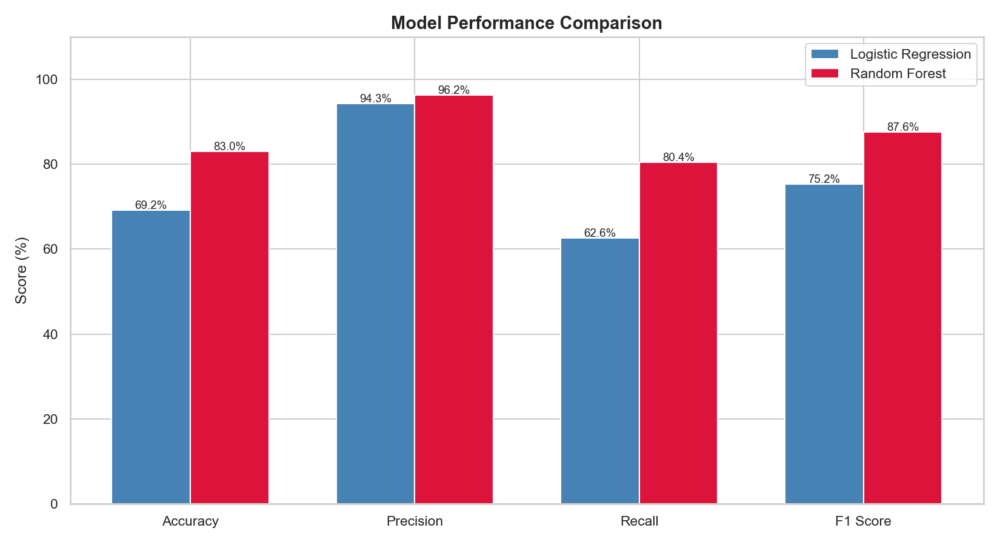
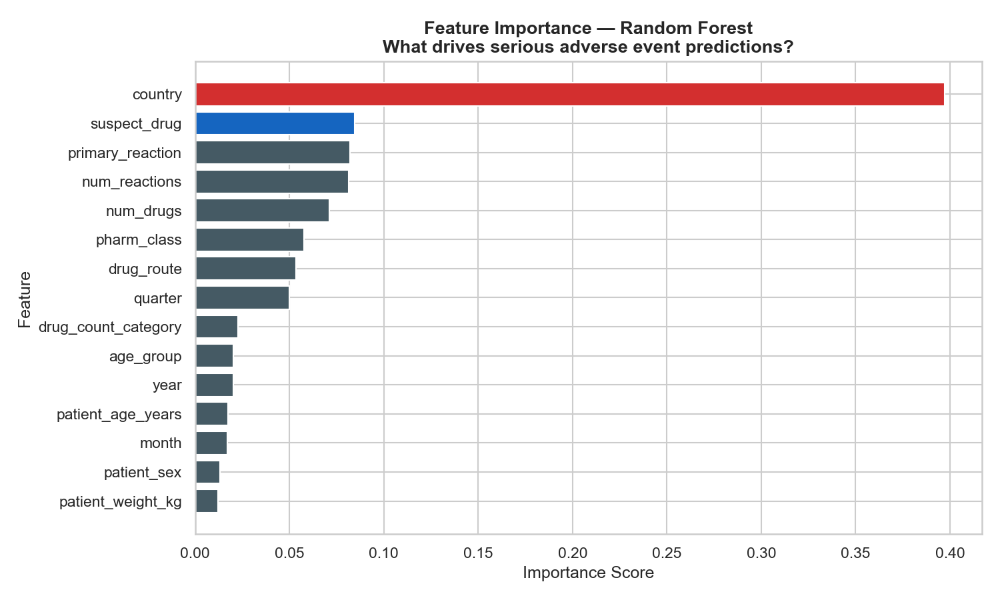
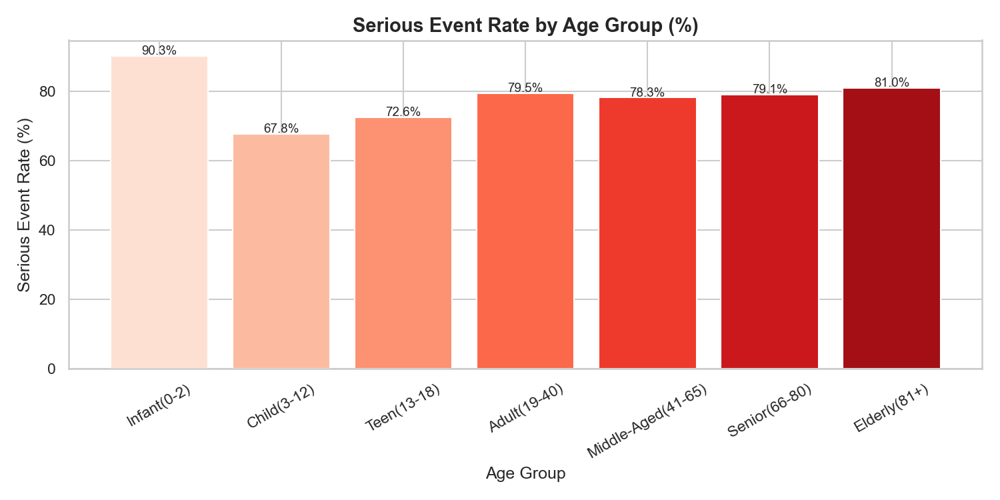
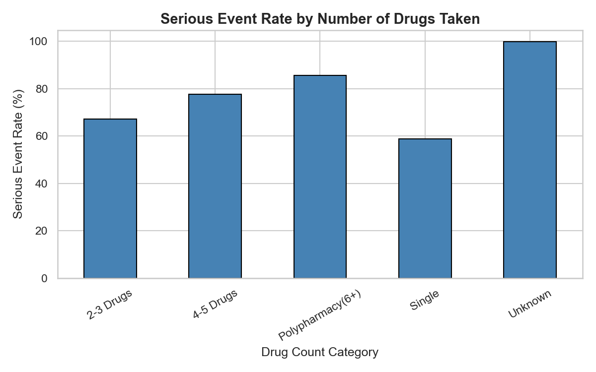
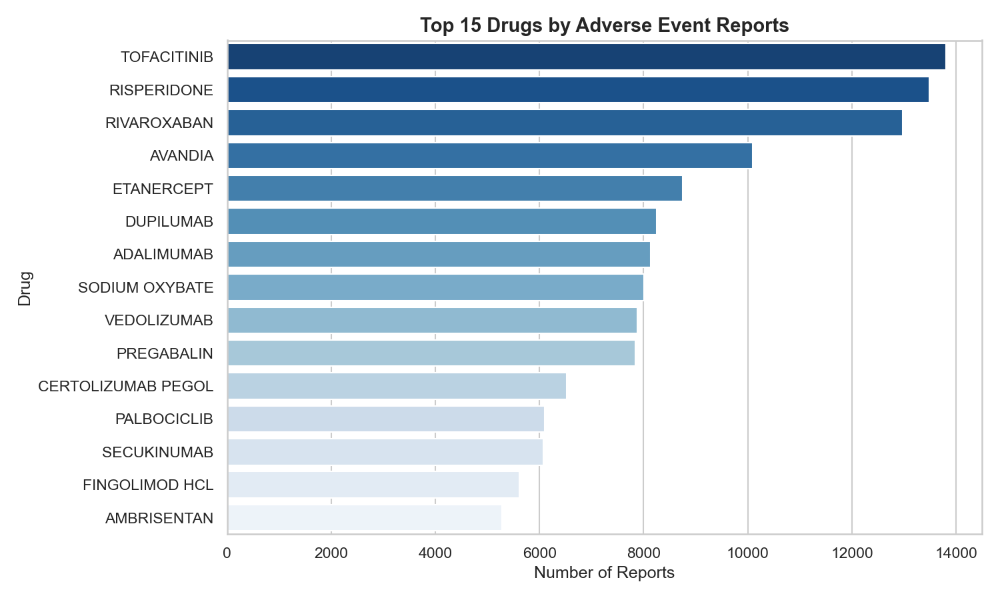
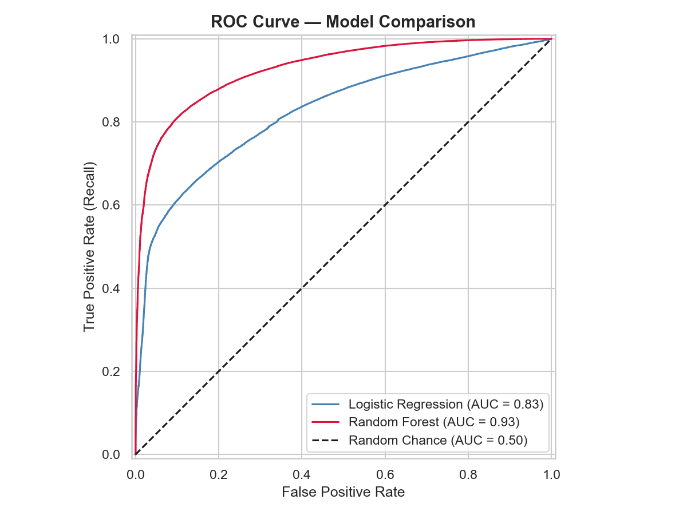

# FDA Adverse Event Predictor

A machine learning project built on 528,000 real FDA drug safety reports (2015–March 2026) to predict whether an adverse drug event will result in a serious outcome — hospitalization, life-threatening reaction, or death — before any clinician has reviewed the report.

**Dataset:** [FDA FAERS 2015–2026 via Kaggle](https://www.kaggle.com/datasets/kanchana1990/fda-drug-adverse-event-reports-2015-to-2026-faers)  
**Tools:** Python, Pandas, Scikit-learn, Matplotlib, Seaborn, Power BI

---

## The Problem

The FDA receives hundreds of thousands of adverse event reports every year. Analysts review them manually, with no automated way to prioritize which cases are most urgent. This project explores whether a machine learning model can reliably flag high-risk reports at the point of submission — before the outcome is known.

---

## What's in This Repo

The project is split across four notebooks, meant to be run in order.

**`01_eda.ipynb`** — Exploratory Data Analysis. Covers the full dataset: missing values, target variable distribution, outcome breakdowns, patient demographics, top drugs by volume and serious event rate, polypharmacy patterns, and trends over time (2015–2026).

**`02_preprocessing.ipynb`** — Data cleaning and preparation. Handles missing value imputation, drops data leakage columns, encodes categorical features, scales numeric features, and produces an 80/20 train/test split stratified by class balance.

**`03_model.ipynb`** — Model training and evaluation. Trains a Logistic Regression baseline and a Random Forest classifier, evaluates both on accuracy, precision, recall, F1, and AUC-ROC, and produces a feature importance analysis showing which variables drive predictions most.

**`04_powerbi_export.ipynb`** — Exports aggregated CSVs for use in a Power BI dashboard.

---

## Key Findings

74.8% of all 528,000 reports were classified as serious — making serious outcomes the baseline, not the exception.

Infants (0–2) had the highest serious event rate at 90.3%. The polypharmacy effect was stark: patients on a single medication had a 58.8% serious event rate, while patients on 6 or more drugs simultaneously faced an 85.7% rate — a 27-point gap driven by drug interactions and underlying illness severity.

The top three drugs by adverse event volume were Tofacitinib (rheumatoid arthritis), Risperidone (antipsychotic), and Rivaroxaban (blood thinner) — all widely prescribed drugs managing chronic conditions in everyday patients. The top three drugs by serious event rate were Azacitidine, Fludarabine Phosphate, and Vincristine Sulfate, all chemotherapy agents sitting near 100%.

---

## Model Results

| Model | Accuracy | Precision | Recall | F1 Score | AUC-ROC |
|---|---|---|---|---|---|
| Logistic Regression | 69.2% | 94.3% | 62.6% | 75.2% | 0.8265 |
| Random Forest | 83.0% | 96.2% | 80.4% | 87.6% | 0.9287 |

The Random Forest correctly identified 80 out of every 100 truly serious adverse events in the held-out test set. Its AUC-ROC of 0.9287 indicates strong discriminative ability — far above the 0.50 baseline of random guessing.

---

## Selected Visuals

---

## Real-World Application

This is a proof of concept for a pharmacovigilance triage tool. A model like this deployed as an API could score every incoming FDA report at submission time, surfacing the highest-risk cases for immediate review rather than treating all reports equally. The result would be faster clinical intervention for the patients who need it most.

---

## How to Run

Clone the repo, download the dataset from the Kaggle link above, place the CSV in the same folder as the notebooks, and run them in order (01 through 04). All dependencies are standard — Pandas, Scikit-learn, Matplotlib, and Seaborn.
